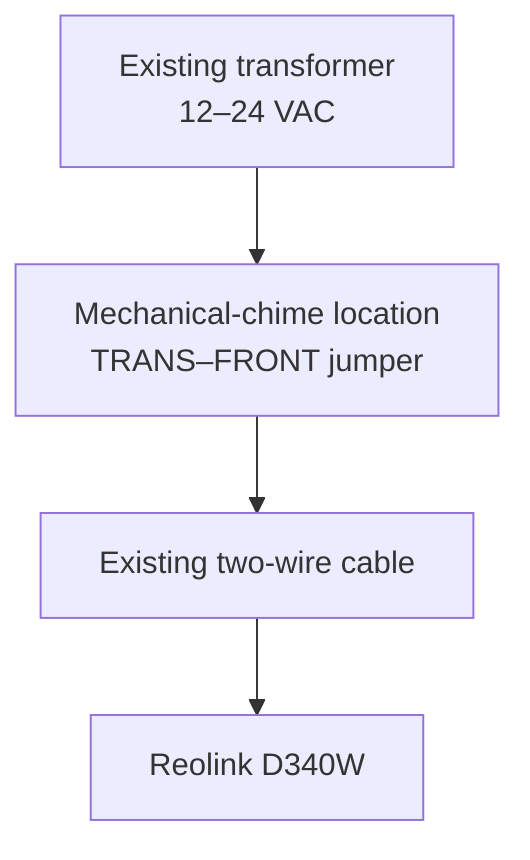

# Recommended existing-wiring installation

## Selected topology

This plan assumes the home currently has:

- One low-voltage doorbell transformer
- One mechanical indoor chime
- One front-door button
- Two existing conductors at the front door

The existing transformer and front-door cable are reused. The mechanical chime is electrically bypassed and replaced by the Reolink plug-in chime.

The two AC wires at the Reolink terminals have no polarity.

## Why this method

Bypassing the mechanical chime gives the camera a continuous power path. Reolink warns that leaving the old chime in series can cause failure to start, instability or reboots, and abnormal chime vibration or sound.

The old mechanical chime will no longer operate after the bypass.

## Before touching wiring

1. Confirm that pressing the existing button rings the mechanical chime. This establishes that the transformer and wiring currently form a working circuit.
2. Locate the doorbell transformer.
3. Read its output label. It must supply 12–24 VAC at 50/60 Hz. Record its VA rating as well; 16 VAC/30 VA is Reolink's common compatibility reference.
4. If the label cannot be read, the topology is unclear, or multiple buttons/chimes are present, stop and trace the circuit before proceeding.
5. Photograph the original connections at the transformer, chime, and exterior button.
6. Turn off the breaker supplying the transformer.
7. Verify that the old chime no longer rings before handling conductors.

## Installation

1. Remove the mechanical chime cover.
2. Identify the terminals labeled `TRANS` and `FRONT`. Do not assume wire colors identify them.
3. Without removing the existing conductors, loosen those two terminal screws.
4. Install the two spade ends of the Reolink-supplied jumper across `TRANS` and `FRONT`.
5. Tighten both screws securely. Ensure no stray conductor can touch another terminal or metalwork.
6. Remove the old exterior pushbutton and retain enough wire length to reconnect or roll back.
7. Mount the Reolink bracket or supplied wedge. Seal the wall penetration appropriately without blocking drainage.
8. Attach one existing conductor to each rear screw terminal on the Reolink. AC polarity does not matter.
9. Secure the doorbell to its bracket.
10. Restore transformer power.
11. Allow the doorbell to boot, then complete initial setup using the Reolink app.
12. Pair the included Reolink plug-in chime.
13. Confirm live view, button notification, chime operation, night view, and reliable operation over several hours.

## Acceptance tests

- Doorbell boots without repeated restarts.
- Live video remains available.
- Button presses consistently reach the Reolink chime and phone.
- Home Assistant can reach the local stream after integration.
- The old mechanical chime is silent and does not buzz.
- No exposed copper or warm transformer/chime components are observed.
- Exterior mounting sheds water and does not pinch the cable.

## Rollback

1. Turn off transformer power.
2. Remove the Reolink and reconnect the original exterior button.
3. Remove the jumper between `TRANS` and `FRONT`.
4. Restore the original chime connections exactly as shown in the pre-work photographs.
5. Restore power and test the original button and chime.

## When not to use this method

Do not proceed with this exact plan when:

- Transformer output is outside 12–24 VAC
- Transformer capacity is inadequate or unknown
- The system has an electronic/digital chime rather than the assumed mechanical chime
- More than one button or chime is connected
- Wiring labels do not match the assumed `TRANS` and `FRONT` arrangement
- The transformer circuit cannot be safely de-energized

For complex wiring, Reolink's alternative is to leave the chime wiring alone and run the video doorbell directly from a compatible transformer.
