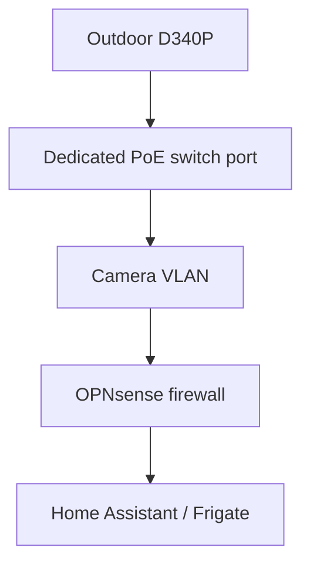

# PoE installation with an isolated exterior port

## Purpose

Use a Reolink Video Doorbell PoE (D340P) for reliable power and networking while preventing the exterior Ethernet cable from providing useful access to the trusted home network.

## Physical path

Run one outdoor-rated or appropriately protected Ethernet cable from the managed PoE switch to the doorbell. Keep splices and couplers inside the protected side of the wall. Provide a drip path and seal the wall penetration without trapping water in the enclosure.

## Switch-port configuration

Configure the doorbell's physical switch port as:

- An untagged access port assigned only to the Camera VLAN
- PoE enabled with the mode required by the doorbell and switch
- No access to the switch-management network
- One learned MAC address maximum, if supported
- Sticky/static MAC binding or port security, if supported
- Shutdown or alert on a MAC-address violation, if supported
- Disabled when the doorbell is removed or the cable is unused

MAC locking is a useful additional control but is not the primary security boundary because a determined person can spoof a MAC address. The Camera VLAN and firewall policy remain the containment boundary.

## OPNsense policy

Use a dedicated Camera VLAN and default-deny policy.

Allow only what is required:

| Source | Destination | Purpose |
|---|---|---|
| Doorbell | Approved DNS resolver | Name resolution, if required |
| Doorbell | Approved NTP service | Time synchronization |
| Doorbell | Home Assistant/Frigate/NVR address | Local video and integration traffic |
| Trusted management device | Doorbell address | Administration and troubleshooting |

Block:

- Camera VLAN to trusted LAN
- Camera VLAN to Proxmox and infrastructure management
- Camera VLAN to NAS management
- Camera VLAN to OPNsense administration
- Camera VLAN to other client VLANs
- Internet access after local commissioning, unless Reolink app/cloud functions are intentionally retained

Prefer management sessions initiated from the trusted network toward the camera. Avoid a broad rule allowing the Camera VLAN to initiate connections to the trusted network.

## Chime behavior

The D340P does not operate the old mechanical chime. Use the compatible Reolink plug-in Chime and/or Home Assistant announcements.

## Installation sequence

1. Select the managed PoE switch port and confirm it can power the D340P.
2. Create the Camera VLAN and firewall policy before connecting the exterior cable.
3. Configure the switch port as an access port on that VLAN.
4. Run and terminate the Ethernet cable.
5. Connect and commission the D340P.
6. Reserve its IP address.
7. Pair the Reolink plug-in Chime.
8. Enable only the local services needed for Home Assistant/Frigate.
9. Test local video and button events.
10. Remove Internet access and confirm the selected local functions still work.
11. Enable MAC limiting/violation handling if supported.
12. Test the exposed-port condition with a different device and confirm it cannot reach trusted networks.

## Acceptance criteria

- Stable PoE power and continuous link
- Doorbell accessible from approved management and recorder systems
- Doorbell unable to initiate access to trusted networks
- Substitute device on the exterior cable cannot reach trusted resources
- Local doorbell event and Reolink Chime work
- Home Assistant/Frigate operation survives an Internet outage
- Exterior cable entry is mechanically secure and weather protected

## Tradeoff

PoE requires a new Ethernet run and managed network configuration, but provides more dependable power and video than Wi-Fi. It is the preferred installation when pulling cable is practical.
